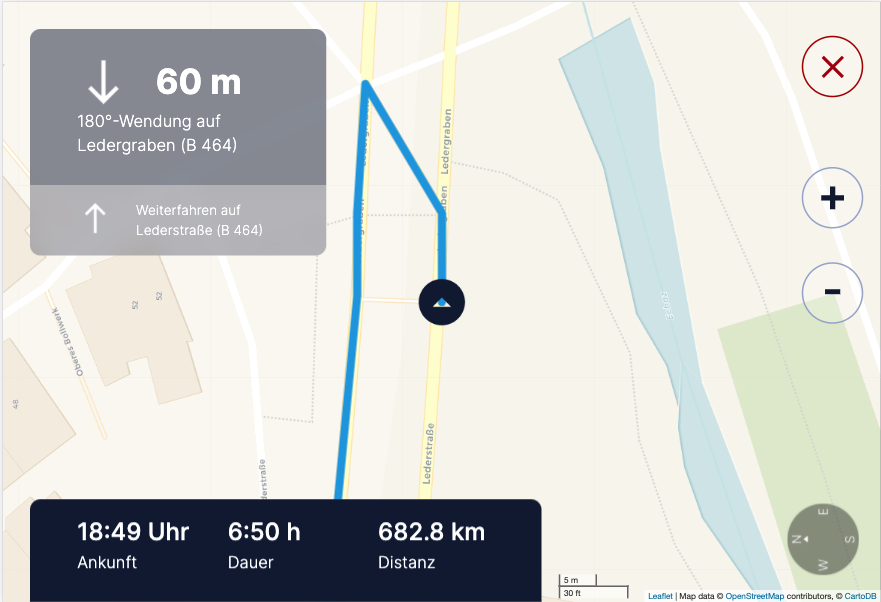

# AGL Navigation on Central Console


<!-- TABLE OF CONTENTS -->
<details open="open">
  <summary>Table of Contents</summary>
  <ol>
    <li>
      <a href="#about-the-project">About The Project</a>
      <ul>
        <li><a href="#built-with">Built With</a></li>
      </ul>
    </li>
    <li>
      <a href="#getting-started">Getting Started</a>
      <ul>
        <li><a href="#prerequisites">Prerequisites</a></li>
        <li><a href="#installation">Installation</a></li>
        <li><a href="#transfer-to-agl">Transfer to AGL</a></li>
      </ul>
    </li>
    <li><a href="#future-work">Future Work</a></li>
    <li><a href="#contact">Contact</a></li>
  </ol>
</details>


<!-- ABOUT THE PROJECT -->
## About The Project



University project about creating a navigation system for an automotive driving simulator on Automotive Grade Linux (AGL) operating system. 
The navigation system software consists of multiple parts, namely:


* [Persistent information panel of the Instrument Cluster](https://github.com/FabianGermany/Homescreen-Instrument-Cluster)
* [Navigation Screen of the Instrument Cluster](https://github.com/FabianGermany/Navigation-System-Instrument-Cluster)
* [Navigation Screen of the Central Console](https://github.com/philipnglr/agl-html5-navigation)
* [Routing algorithm](https://github.com/SebEckl/agl-service-routing.git)
* [LED panel for visualization of navigation instructions](https://github.com/mueller-kai/Arduino_LedCode-for-Driving-Simulator)

This repository is about the AGL navigation application for the central console display.

### Built With

* [Automotive Grade Linux](https://www.automotivelinux.org/) (AGL)
* [AGLs html5-dasbhoard](https://gerrit.automotivelinux.org/gerrit/admin/repos/apps/html5-dashboard) as a basic app template
* [Leaflet](https://leafletjs.com/) vanilla
* [Leaflet](https://github.com/ronikar/Leaflet) extended by GitHub user ronikar
* [Leaflet Routing Machine](https://www.liedman.net/leaflet-routing-machine/)
* [Node JS](https://nodejs.org)
* [Webpack JS](https://webpack.js.org/)


<!-- GETTING STARTED -->
## Getting Started

To get a local copy up and running follow these steps:

### Prerequisites

* [Node JS](https://nodejs.org)
* [Automotive Grade Linux](https://www.automotivelinux.org/) (AGL)

### Installation

1. Clone the repo
   ```sh
   git clone https://github.com/philipnglr/agl-html5-navigation
   ```
2. Install NPM packages
   ```sh
   npm install
   ```
3. Compile app
   ```sh
   npm run build
   ```
4. Start up the app
   ```sh
   npm start
   ```
5. Open up [http://localhost:9000/](http://localhost:9000/) in your browser

### Transfer to AGL

6. Transfer the .wgt inside the package folder onto your AGL system

7. Install .wgt on AGL
   ```sh
   afm-util install [APP-NAME].wgt
   ```
8. Reboot AGL
   ```sh
   reboot
   ```

## Future Work

Open src folder and search for "TODO: " inside app.js, choose-location.js and map.js. 
You will find To-Do's with detailed description about future work and how to set up the navigation application together with the other parts. 
Ignore all other To-Do's since these are from leaflet versions. These are out of scope for the project provided.


<!-- CONTACT -->
## Contact

Philip Engler - philip.engler@student.reutlingen-university.com

Project Link: [https://github.com/philipnglr/agl-html5-navigation](https://github.com/philipnglr/agl-html5-navigation)

